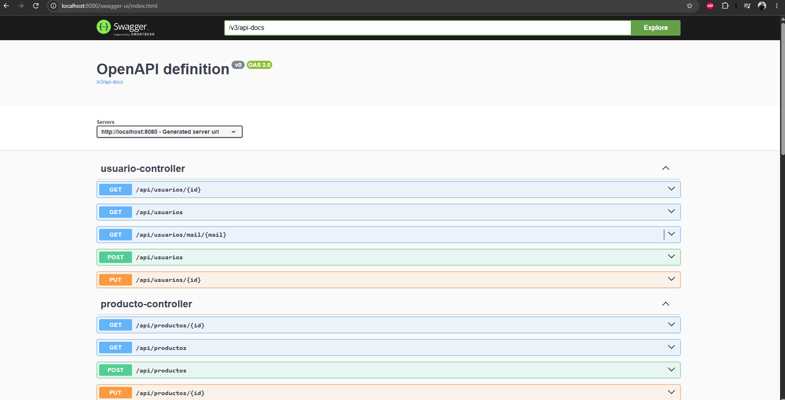
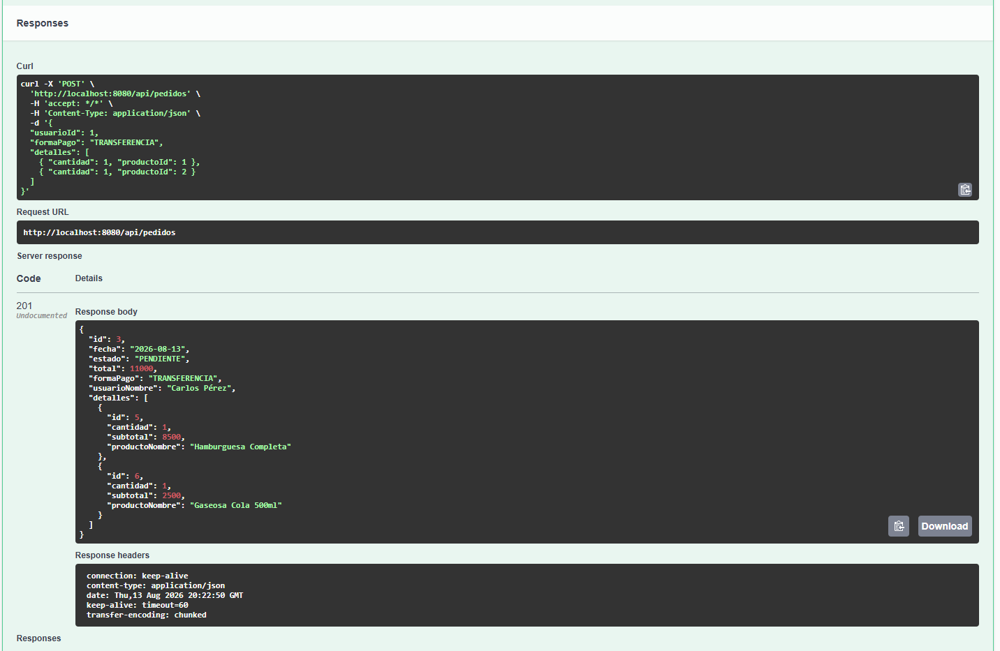
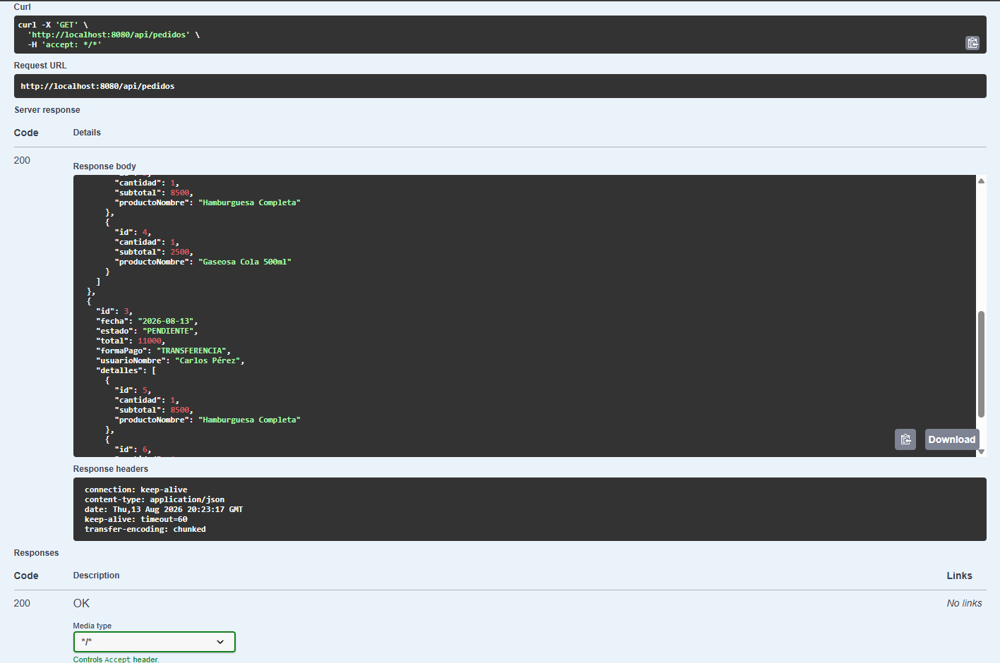

# Unidad 2: Desarrollo de API REST Profesional con Spring Boot y Swagger 🚀

**Tecnicatura Universitaria en Programación — Universidad Tecnológica Nacional (UTN)**  
**Cátedra:** Programación IV  
**Trabajo Práctico:** API REST, Persistencia JPA y Documentación con Swagger/OpenAPI  

---

## 📌 Objetivo General

Desarrollar una **API REST completa y profesional** para la gestión de usuarios, categorías, productos y pedidos, aplicando:
* **Arquitectura en capas desacoplada** (*Controller, Service, Repository, DTOs, Entities*).
* **Transferencia segura de datos mediante DTOs** (*Data Transfer Objects*) usando Java Records.
* **Persistencia con Spring Data JPA y Hibernate** sobre base de datos en memoria H2.
* **Lógica de negocio encapsulada y cálculo automático de totales**.
* **Manejo global y centralizado de excepciones** mediante `@RestControllerAdvice`.
* **Documentación interactiva y estandarizada de endpoints** mediante **Swagger / OpenAPI 3.0** (`SpringDoc`).

---

## 🛠️ Tecnologías y Herramientas

| Componente | Tecnología / Versión |
| :--- | :--- |
| **Lenguaje** | Java 21 / 24 |
| **Framework Principal** | Spring Boot 3.2.5 |
| **Persistencia** | Spring Data JPA / Hibernate Core |
| **Base de Datos** | H2 Database (In-Memory) |
| **Documentación API** | SpringDoc OpenAPI Starter WebMVC UI 2.5.0 (Swagger UI) |
| **Validaciones** | Spring Boot Starter Validation (Hibernate Validator) |
| **Productividad** | Project Lombok 1.18.38 |
| **Gestor de Construcción** | Apache Maven |

---

## 🏗️ Arquitectura del Proyecto

El proyecto implementa el patrón por capas garantizando separación de responsabilidades:

```
src/main/java/com/utn/unidad_1_fundamentos/
├── config/
│   └── DataInitializer.java          # Carga automática de datos de prueba al iniciar (H2)
├── controllers/
│   ├── CategoriaController.java      # Endpoints REST para Categorías
│   ├── PedidoController.java         # Endpoints REST para Pedidos
│   ├── ProductoController.java       # Endpoints REST para Productos
│   └── UsuarioController.java        # Endpoints REST para Usuarios
├── dtos/
│   ├── ErrorDto.java                 # Formato estándar de respuesta ante excepciones
│   ├── categoria/                    # DTOs: CategoriaCreate, CategoriaEdit, CategoriaDto
│   ├── detallepedido/                # DTOs: DetallePedidoCreate, DetallePedidoDto
│   ├── pedido/                       # DTOs: PedidoCreate, PedidoEdit, PedidoDto
│   ├── producto/                     # DTOs: ProductoCreate, ProductoEdit, ProductoDto
│   └── usuario/                      # DTOs: UsuarioCreate, UsuarioEdit, UsuarioDto
├── entities/
│   ├── Base.java                     # Superclase mapeada (@MappedSuperclass) con ID y soft delete
│   ├── Calculable.java               # Interfaz para cálculo de totales de pedidos
│   ├── Categoria.java                # Entidad Categoría
│   ├── DetallePedido.java            # Entidad DetallePedido
│   ├── Pedido.java                   # Entidad Pedido con lógica de negocio agregada
│   ├── Producto.java                 # Entidad Producto
│   ├── Usuario.java                  # Entidad Usuario
│   └── enums/                        # Enumeraciones: Estado, FormaPago, Rol
├── exceptions/
│   └── GlobalExceptionHandler.java   # Manejador centralizado de errores (@RestControllerAdvice)
├── repositories/                     # Interfaces Spring Data JPA (JpaRepository)
│   ├── CategoriaRepository.java
│   ├── DetallePedidoRepository.java
│   ├── PedidoRepository.java
│   ├── ProductoRepository.java
│   └── UsuarioRepository.java
├── services/                         # Capa de lógica de negocio y mapeo a DTOs
│   ├── CategoriaService.java
│   ├── PedidoService.java
│   ├── ProductoService.java
│   └── UsuarioService.java
└── Unidad1FundamentosApplication.java # Clase principal Spring Boot
```

---

## 📖 Documentación Interactiva con Swagger UI

La API cuenta con documentación interactiva generada automáticamente bajo la especificación OpenAPI 3.0:

* **Swagger UI:** [http://localhost:8080/swagger-ui/index.html](http://localhost:8080/swagger-ui/index.html)
* **OpenAPI JSON Spec:** [http://localhost:8080/v3/api-docs](http://localhost:8080/v3/api-docs)

---

## 📸 Evidencias de Ejecución y Pruebas en Swagger

### 1. Panel General de Endpoints (Swagger UI)
Vista general de los controladores y operaciones HTTP documentadas:



---

### 2. Creación de un Pedido (`POST /api/pedidos`)
Registro de un nuevo pedido con múltiples detalles, asociación a usuario y cálculo dinámico de subtotales y total general:



#### 📤 Request Body:
```json
{
  "usuarioId": 1,
  "formaPago": "TRANSFERENCIA",
  "detalles": [
    { "cantidad": 1, "productoId": 1 },
    { "cantidad": 1, "productoId": 2 }
  ]
}
```

#### 📥 Server Response (`201 Created`):
```json
{
  "id": 3,
  "fecha": "2026-08-13",
  "estado": "PENDIENTE",
  "total": 11000.0,
  "formaPago": "TRANSFERENCIA",
  "usuarioNombre": "Carlos Pérez",
  "detalles": [
    {
      "id": 5,
      "cantidad": 1,
      "subtotal": 8500.0,
      "productoNombre": "Hamburguesa Completa"
    },
    {
      "id": 6,
      "cantidad": 1,
      "subtotal": 2500.0,
      "productoNombre": "Gaseosa Cola 500ml"
    }
  ]
}
```

---

### 3. Consulta de Pedidos (`GET /api/pedidos`)
Listado completo de pedidos registrados persistidos en la base de datos:



#### 📥 Server Response (`200 OK`):
```json
[
  {
    "id": 1,
    "fecha": "2026-08-13",
    "estado": "PENDIENTE",
    "total": 19500.0,
    "formaPago": "EFECTIVO",
    "usuarioNombre": "Carlos Pérez",
    "detalles": [
      {
        "id": 1,
        "cantidad": 2,
        "subtotal": 17000.0,
        "productoNombre": "Hamburguesa Completa"
      },
      {
        "id": 2,
        "cantidad": 1,
        "subtotal": 2500.0,
        "productoNombre": "Gaseosa Cola 500ml"
      }
    ]
  }
]
```

---

## 📋 Resumen de Endpoints Disponibles

### 👤 Usuarios (`/api/usuarios`)
| Método | Endpoint | Descripción | Código Éxito |
| :--- | :--- | :--- | :--- |
| `GET` | `/api/usuarios` | Listar todos los usuarios activos | `200 OK` |
| `GET` | `/api/usuarios/{id}` | Buscar usuario por ID (muestra datos por consola) | `200 OK` |
| `GET` | `/api/usuarios/mail/{mail}` | Buscar usuario por Email (muestra datos por consola) | `200 OK` |
| `POST` | `/api/usuarios` | Registrar un nuevo usuario | `201 Created` |
| `PUT` | `/api/usuarios/{id}` | Actualizar datos de un usuario existente | `200 OK` |

### 🍔 Productos (`/api/productos`)
| Método | Endpoint | Descripción | Código Éxito |
| :--- | :--- | :--- | :--- |
| `GET` | `/api/productos` | Listar todos los productos disponibles | `200 OK` |
| `GET` | `/api/productos/{id}` | Obtener detalle de un producto por ID | `200 OK` |
| `POST` | `/api/productos` | Crear un nuevo producto asociado a una categoría | `201 Created` |
| `PUT` | `/api/productos/{id}` | Actualizar información de un producto | `200 OK` |

### 🏷️ Categorías (`/api/categorias`)
| Método | Endpoint | Descripción | Código Éxito |
| :--- | :--- | :--- | :--- |
| `GET` | `/api/categorias` | Listar todas las categorías activas | `200 OK` |
| `GET` | `/api/categorias/{id}` | Obtener una categoría por ID | `200 OK` |
| `POST` | `/api/categorias` | Registrar una nueva categoría | `201 Created` |
| `PUT` | `/api/categorias/{id}` | Actualizar nombre y descripción de una categoría | `200 OK` |

### 🛒 Pedidos (`/api/pedidos`)
| Método | Endpoint | Descripción | Código Éxito |
| :--- | :--- | :--- | :--- |
| `GET` | `/api/pedidos` | Listar todos los pedidos con sus detalles | `200 OK` |
| `GET` | `/api/pedidos/{id}` | Consultar pedido específico por ID | `200 OK` |
| `POST` | `/api/pedidos` | Crear pedido, asociar ítems y calcular total | `201 Created` |
| `PUT` | `/api/pedidos/{id}/estado` | Actualizar el estado del pedido (`PENDIENTE`, `CONFIRMADO`, etc.) | `200 OK` |

---

## 🛡️ Manejo Centralizado de Excepciones

La clase `GlobalExceptionHandler` intercepta los errores lanzados por la aplicación y devuelve un formato estructurado y uniforme:

```json
{
  "timestamp": "2026-08-13T16:30:00",
  "status": 400,
  "mensaje": "Petición inválida",
  "detalles": "Usuario no encontrado con ID: 99"
}
```

---

## 🚀 Instrucciones de Ejecución

### Prerrequisitos
* Java Development Kit (**JDK 21** o superior).
* Git y Maven (opcional, incluye wrapper `./mvnw`).

### 1. Clonar el repositorio
```bash
git clone https://github.com/brianrios97/UTN-Programacion-IV.git
cd UTN-Programacion-IV/Unidad_2_API_REST
```

### 2. Ejecutar la aplicación
* **Con Maven Wrapper:**
  ```bash
  ./mvnw spring-boot:run
  ```
* **En Windows PowerShell / CMD:**
  ```powershell
  .\mvnw.cmd spring-boot:run
  ```
* **Desde IntelliJ IDEA:**
  Ejecutar la clase `Unidad1FundamentosApplication.java` dentro del módulo `Unidad_2_API_REST`.

### 3. Acceder a los servicios
* **Documentación Swagger UI:** `http://localhost:8080/swagger-ui/index.html`
* **Consola de Base de Datos H2:** `http://localhost:8080/h2-console`
  * *JDBC URL:* `jdbc:h2:mem:testdb`
  * *User:* `sa`
  * *Password:* *(vacío)*